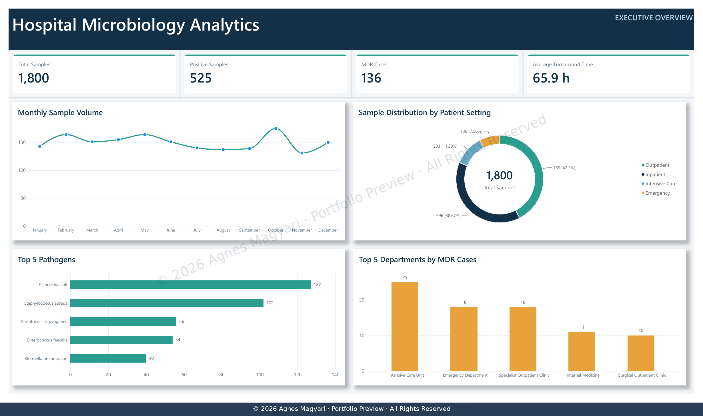
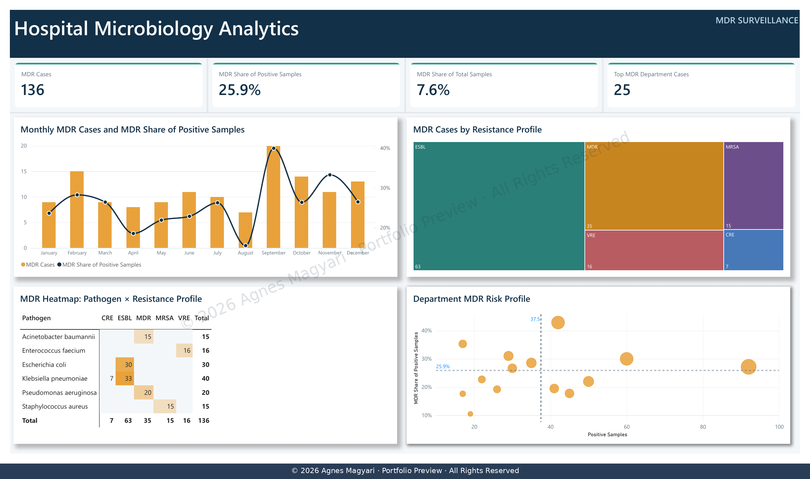
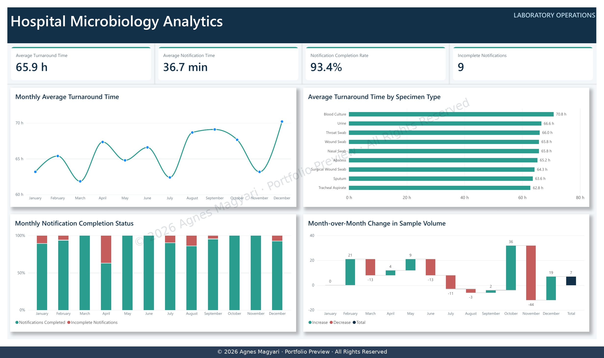
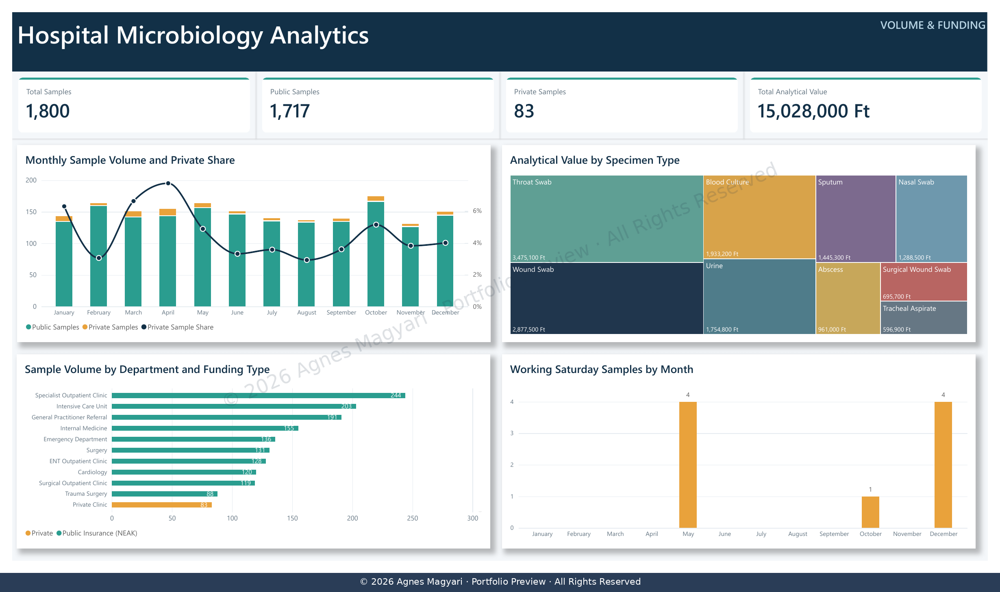

# Hospital Microbiology Analytics

## Power BI Portfolio Project

An end-to-end business intelligence project designed to transform hospital microbiology data into clear, actionable management insights.

The report combines executive-level performance monitoring with multidrug-resistant organism surveillance, laboratory operational analysis, and funding-related insights.

> **Portfolio preview:** This repository presents a curated overview of the project. The complete interactive Power BI report is available for presentation during an interview.

## Dashboard Previews

*Executive Overview — a management-level summary of laboratory volume, positive samples, MDR cases, turnaround time, patient settings, leading pathogens, and departments with the highest MDR case counts.*

*MDR Surveillance — an analytical view of multidrug-resistant cases, resistance profiles, pathogen patterns, monthly trends, and department-level MDR risk.*

*Laboratory Operations — an operational view of turnaround time, notification performance, specimen-level processing times, and monthly changes in laboratory workload.*

*Volume & Funding — an overview of public and private sample volumes, analytical value by specimen type, departmental funding distribution, and working-Saturday activity.*

---

## Project Overview

This project demonstrates how microbiology laboratory data can support both clinical awareness and management decision-making.

The analytical report was designed to answer four key questions:

- What is the overall laboratory sample volume and positivity rate?
- How significant is multidrug resistance within positive samples?
- How efficiently does the laboratory process and communicate results?
- How are sample volumes and analytical values distributed across departments, specimen types, and funding categories?

---

## Dashboard Pages

### 1. Executive Overview

Provides a concise management summary of:

- total and positive sample volumes;
- multidrug-resistant cases;
- average laboratory turnaround time;
- monthly sample-volume trends;
- patient-setting distribution;
- leading pathogens;
- departments with the highest MDR case counts.

### 2. MDR Surveillance

Supports antimicrobial-resistance monitoring through:

- monthly MDR case trends;
- MDR share of positive and total samples;
- resistance-profile distribution;
- pathogen and resistance-profile analysis;
- department-level MDR risk comparison.

### 3. Laboratory Operations

Evaluates laboratory performance using:

- average turnaround time;
- average notification time;
- notification completion rate;
- incomplete notification count;
- specimen-level turnaround-time comparison;
- monthly changes in sample volume.

### 4. Volume & Funding

Examines operational volume and financial context through:

- public and private sample volumes;
- private-sample share;
- analytical value by specimen type;
- department and funding-type comparison;
- working-Saturday sample activity.

---

## Analytical Approach

The project applies:

- data cleaning and transformation with Power Query;
- dimensional data modelling;
- DAX measures and calculated business indicators;
- time-based trend analysis;
- KPI design;
- conditional formatting;
- cross-filtering and interactive visual analysis;
- management-focused dashboard design;
- data-quality and filter-context validation.

---

## Tools and Technologies

- Microsoft Power BI
- Power Query
- DAX
- Dimensional Data Modelling
- Data Visualisation
- Business Intelligence
- Healthcare Analytics
- Clinical Microbiology Domain Knowledge

---

## Business Value

The report helps decision-makers:

- identify changes in laboratory workload;
- monitor multidrug-resistant organism patterns;
- recognise departments with elevated MDR exposure;
- evaluate turnaround and notification performance;
- compare operational demand across specimen types;
- understand the relationship between sample volume, funding type, and analytical value.

---

## About the Author

**Agnes Magyari**

Business intelligence and data analytics professional with practical experience in clinical microbiology and additional expertise in pharmaceutical microbiology. She also holds an internal auditor qualification, strengthening her understanding of quality management, regulatory compliance, and process evaluation.

This project brings together her microbiology background, quality-oriented approach, and Power BI development skills to deliver clear, management-focused analytical reporting.

---

## Copyright and Usage

**© 2026 Agnes Magyari. All Rights Reserved.**

This repository contains a portfolio presentation only. The underlying dataset, Power BI source file, data model, complete DAX implementation, and detailed analytical documentation are not publicly distributed.

No permission is granted to copy, modify, redistribute, publish, or reuse the contents of this repository without the prior written consent of Agnes Magyari.
